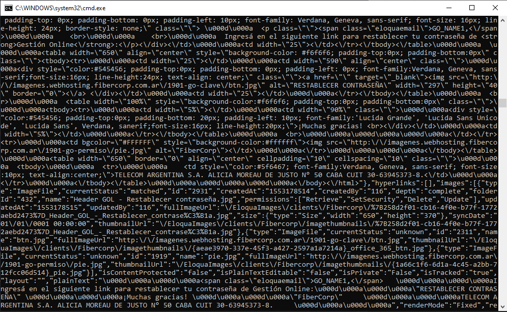

# First entry
_Writing in Markdown is not that hard!_

**I will complete these lessons!**   

# Second entry  
## Cupcake ipsum dolor sit amet topping I love.
- Chocolate cake I love chocolate cookie oat cake.
- Marzipan dragée I love danish I love cake sugar plum cotton candy.
- Toffee biscuit icing.
- Dessert marshmallow cookie gummi bears caramels tiramisu.
- Macaroon bear claw chupa chups I love bear claw cotton candy.

## Wafers
Wafer liquorice tootsie roll cake oat cake danish jelly beans.  
Wafer sesame snaps tart biscuit sweet jujubes fruitcake topping cheesecake. I love marzipan jelly-o macaroon bonbon pastry candy canes.  
>[This is a quote:]Topping halvah donut pie donut. I love jelly I love bonbon lemon drops biscuit. Chocolate bar cookie I love cotton candy bonbon.   

Marshmallow macaroon toffee. Icing tootsie roll cookie bear claw I love icing I love topping. Chocolate cake dragée toffee tiramisu icing powder fruitcake.
### Lists
#### Unordered
- I'm baby blog celiac mumblecore meh disrupt before they sold out.
- Photo booth tbh pok pok shoreditch taiyaki banjo keffiyeh shabby chic semiotics bicycle rights whatever thundercats irony.
- Lyft shaman pour-over, tilde mixtape sartorial four loko cloud bread letterpress kickstarter tousled actually.
- Viral marfa selvage swag, meggings stumptown cliche jianbing seitan banjo.
#### Ordered
1. Pitchfork jean shorts viral chambray succulents.
2. 3 wolf moon echo park trust fund yuccie four dollar toast raw denim disrupt synth.
3. Occupy cornhole hell of food truck knausgaard, pinterest artisan microdosing woke coloring book mumblecore heirloom jean shorts.
4. Shoreditch disrupt tumblr af, chillwave fingerstache schlitz franzen enamel pin small batch.
  4.1. Tote bag jean shorts messenger bag ramps prism.
  1. Butcher four loko beard ennui activated charcoal intelligentsia coloring book palo santo echo park tbh.
  2. Direct trade wayfarers kickstarter hot chicken selfies.
  3. Taxidermy heirloom ethical glossier marfa.
  4. Organic ethical kickstarter live-edge.
  5. Heirloom gluten-free vinyl, dreamcatcher waistcoat cardigan man bun squid butcher.
  6. Plaid pabst lomo locavore chambray.
5. Keytar VHS leggings pinterest literally, godard enamel pin tacos street art prism plaid pug four loko YOLO.
6. Shabby chic vice four loko, next level hashtag flexitarian hammock heirloom tumeric deep v kickstarter taiyaki aesthetic.

# Third entry - Tables

### First table:
>the text below was taken from May's report.    

Note: _enumeration for OAuth tests was given according to Swagger API_   

| Test | Funcion | Descripción | Resultado esperado |
|:---|:---|:---:|:-:|
|              |         |        |                    |
|             |         |             |                    |
|             |         |             |                    |
| 8     |Inicio de sesión |El inició de sesión consta de recibir un usuario y contraseña, que va a ser validado contra la base de datos (comparando el password con el hashed guardado en la base); este en caso de ser valido, va a generar cookies que van a ser guardados en el browser y la sesión del navegador.| codigo 200 - Success / Éxito|
|             |         |             |                    |
|             |         |             |                    |
|             |         |             |                    |
|             |         |             |                    |
|             |         |             |                    |

_enumeration for Eloqua API was given according to Swagger API_     
_enumeration for OAuth tests was given according to Swagger API_   

### Second table:
[source](https://www.tablesgenerator.com/markdown_tables)   

|  N° | Función   | Descripción   |  Resultado esperado |
|:-|:-|:-|:-|
| 8   |Inicio de sesión   | El inició de sesión consta de recibir un usuario y contraseña, que va a ser validado contra la base de datos (comparando el password con el hashed guardado en la base); este en caso de ser valido, va a generar cookies que van a ser guardados en el browser y la sesión del navegador.   | codigo 200 - Success / Éxito  |
|   |   |   |   |
|   |   |   |   |
|   |   |   |   |
|   |   |   |   |
|   |   |   |   |
|   |   |   |   |

Some paragraph here.   

And here too.   

# Fourth entry - Images

# Fifth entry - Links

#### 1.

Use [Duck Duck Go](https://duckduckgo.com).
>Without whitespace between brackets and parentheses.
#### 2.  

- this is an URL: <https://erf.org>
- this is an email: <testuser@gmail.com>;

# Sixth entry - ...(still don't known)
## List of Oauth tests
